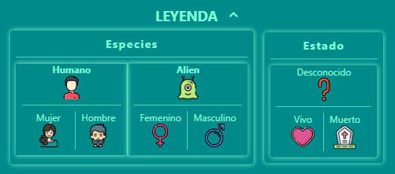

This project was bootstrapped with [Create React App](https://github.com/facebook/create-react-app).

# Módulo 3: Ejercicio de evaluación final

#### Mercedes Carballal


## Buscador de personajes de Rick y Morty

El ejercicio consiste en desarrollar una página web _responsive_ con un **listado de personajes de Rick and Morty**, que
podemos filtrar por el nombre del personaje. Vamos a usar React para realizarlo.
Vamos de definir las distintas partes del ejercicio:

### INDICE

1. [Estructura de datos](#Estructura-de-datos)
2. [Listado de personajes](#Listado-de-personajes)
3. [Filtrado de personajes](#Filtrado-de-personajes)
4. [Detalle de personajes](#Detalle-de-personajes)
5. [Pendiente](#Pendiente)
6. [Sugerencias](#Sugerencias)

---

1.  ### Estructura de datos

```
src
 ├─ Components
 |  └─ App.js
 |      ├─ Filters.js
 |      ├─ CharacterList.js
 |      |   └─ CharacterCard.js
 |      └─ CharacterDetail.js
 |          └─ Leyend.js
 ├─ images
 ├─ services
 |   └─ getDataFromApi.js
 ├─ scss
 |  ├─ components
 |  ├─ core
 |  ├─ layout
 |  └─ pages
 └─ html
    └─ partials
```

---

2.  ### Listado de personajes

En primer lugar, vamos a realizar una web con el listado de personajes de Rick and Morty.
Para eso, vamos a utilizar el servicio de https://rickandmortyapi.com/documentation/#get-all-characters que nos devuelve información sobre los primeros 20 personajes de la serie. Sobre cada uno, vamos a pintar al menos: la foto, el nombre y la especie.


- **BONUS:** Usar algún sistema de grid para pintar el listado de personajes.
- **BONUS:** Ordenar el listado de personajes alfabéticamente por nombre.

- **EXTRA:** Guardamos y rrecogemos los datos al LocalStorage para mantener la última búsqueda que hayamos realizado.


3.  ### Filtrado de personajes

Ahora que ya tenemos el listado de personajes en pantalla, la segunda parte consiste en poder buscarlos por nombre. Para eso, añadimos un `input` a la interfaz, de forma que al ir escribiendo un nombre queden en la interfaz solo los personajes cuyo nombre contiene las letras escritas.

> **NOTA:** El filtro debe filtrar independientemente de que la usuaria introduzca el texto en mayúsuclas o minúsculas.


> **NOTA:** Si buscamos por un texto por ejemplo "XXX" y no hay ningún personaje que coincida con dicho texto se muestra un mensaje de error que dice: _"No hay ningún personaje que coincida con la palabra XXX"_.


- **EXTRA** También hemos creado varios `select` para poder filtar los personajes por especie, género y estado.


4.  ### Detalle de personajes

Implementamos una **nueva funcionalidad**: al hacer clic sobre la tarjeta de un personaje, su información aparecerá a pantalla completa.

Para hacer esto usamos `rutas` y `React router`.

En la pantalla de detalle aparecerá además de la foto, nombre y especie; el planeta de origen, el número de episodios en los que aparece y si está **vivo** o **muerto**.

- **BONUS:** Mostramos la especie, el estado y el género con un icono.


- **BONUS:** La URL del detalle de personaje es compartible, es decir, que si visitamos esa URL directamente en el navegador se ve el detalle del personaje. Y en el caso de que el usuario navegue a una URL inexistente como por ejemplo http://localhost:3000/#/detail/12345 (el id 12345 no existe) mostramos un mensaje del tipo _"El personaje que buscas no existe"_.


> **NOTA:** Al entrar en el detalle de un personaje y a continuación pulsar atrás, el campo de texto de búsqueda muestra el texto que tenía anteriormente.

- **EXTRA** He añadido una leyenda colapsable para aclarar cualquier tipo de duda con los iconos.



5.  ### Pendiente

Me gustaría seguir implementando:

- Un App.test.js
- Añadir un Loading al pedir los datos al Api
- Un reseteo de filtros
- Funcionalidad para pasar de página al ver el listado de personaje
- Funcionalidad para pasar de personaje al ver el detalle de cada uno
- Añadir una página landing
- Añadir enlace a la página principal desde el error de ruta de detalle

6. ### Sugerencias

Me encantaría recibir tu feedback, no dudes en abrir una PullRequest o Issue para seguir mejorando.

Gracias!
